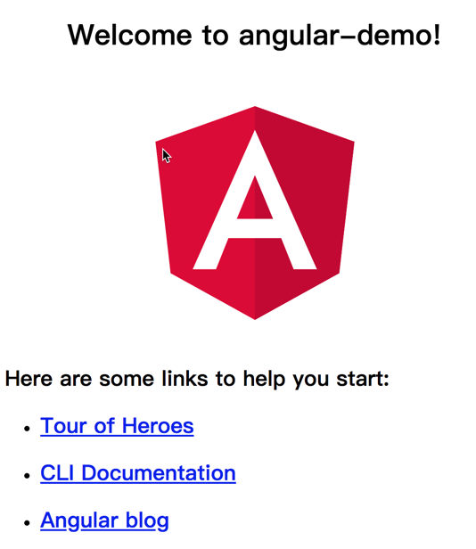
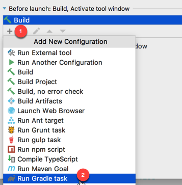
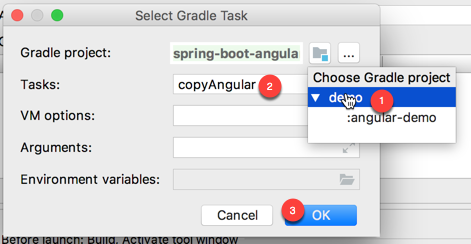

# spring-boot-angular-kotlin-gradle

Integrate angular 7.0.1 + Spring boot 2.0.6 + Gradle 4.8.1 + Kotlin

This project shows how to integrate angular with spring boot under gradle.

## Step

### Create a spring boot project

```shell
curl https://start.spring.io/starter.zip -o spring-boot-angular-kotlin-gradle.zip -d dependencies=web,actuator -d language=kotlin -d type=gradle-project
unzip spring-boot-angular-kotlin-gradle.zip -d spring-boot-angular-kotlin-gradle
```

### Create a angular frontend project

```shell
cd spring-boot-angular-kotlin-gradle
ng new angular-demo
```

```shell
? Would you like to add Angular routing? (y/N) y
? Which stylesheet format would you like to use? (Use arrow keys) [enter]
```

### Make angular as a gradle project

In angular-demo folder, create a build.gradle file:

```groovy
plugins {
  id "com.moowork.node" version "1.2.0"
}

apply plugin: 'com.moowork.node'

version '0.0.1'

node {
  version = '8.12.0'
  npmVersion = '4.4.1'
  download = true
  workDir = file("${project.buildDir}/node")
  nodeModulesDir = file("${project.projectDir}")
}

task build(type: NpmTask) {
  args = ['run', 'build']
}

build.dependsOn(npm_install)
```

### Modify spring-boot-angular-kotlin-gradle

In spring-boot-angular-kotlin-gradle/build.gradle, append codes at the end:

```groovy
buildscript {
    ext {
        kotlinVersion = '1.2.51'
        springBootVersion = '2.0.6.RELEASE'
    }
    repositories {
        mavenCentral()
    }
    dependencies {
        classpath("org.springframework.boot:spring-boot-gradle-plugin:${springBootVersion}")
        classpath("org.jetbrains.kotlin:kotlin-gradle-plugin:${kotlinVersion}")
        classpath("org.jetbrains.kotlin:kotlin-allopen:${kotlinVersion}")
    }
}

apply plugin: 'kotlin'
apply plugin: 'kotlin-spring'
apply plugin: 'eclipse'
apply plugin: 'org.springframework.boot'
apply plugin: 'io.spring.dependency-management'

group = 'com.example'
version = '0.0.1-SNAPSHOT'
sourceCompatibility = 1.8
compileKotlin {
    kotlinOptions {
        freeCompilerArgs = ["-Xjsr305=strict"]
        jvmTarget = "1.8"
    }
}
compileTestKotlin {
    kotlinOptions {
        freeCompilerArgs = ["-Xjsr305=strict"]
        jvmTarget = "1.8"
    }
}

repositories {
    mavenCentral()
}


dependencies {
    implementation('org.springframework.boot:spring-boot-starter-web')
    implementation('com.fasterxml.jackson.module:jackson-module-kotlin')
    implementation("org.jetbrains.kotlin:kotlin-stdlib-jdk8")
    implementation("org.jetbrains.kotlin:kotlin-reflect")
    testImplementation('org.springframework.boot:spring-boot-starter-test')
}

// ------> new added codes
bootJar {
    from('angular-demo/dist/angular-demo') {
        into 'public'
    }
}

task copyAngular(type: Copy) {
    from 'angular-demo/dist/angular-demo'
    into "$buildDir/resources/main/public"
    into "out/production/resources/public"
}

//frontend:build will be run before the processResources
processResources.dependsOn(':angular-demo:build')

build.dependsOn('copyAngular')
// <-------
```

In settings.gradle, append:

```groovy
rootProject.name = 'demo'
// new added codes
include 'angular-demo'
```

### Build & run

```shell
./gradlew bootJar
```

Run:

```shell
java -jar build/libs/demo-0.0.1-SNAPSHOT.jar
```

In browser, type: `http://localhost:8080`， you will see angular demo page:



### Run in Idea

Open spring-boot-angular-kotlin-gradle，

In `Run/Edit Configurations...`




